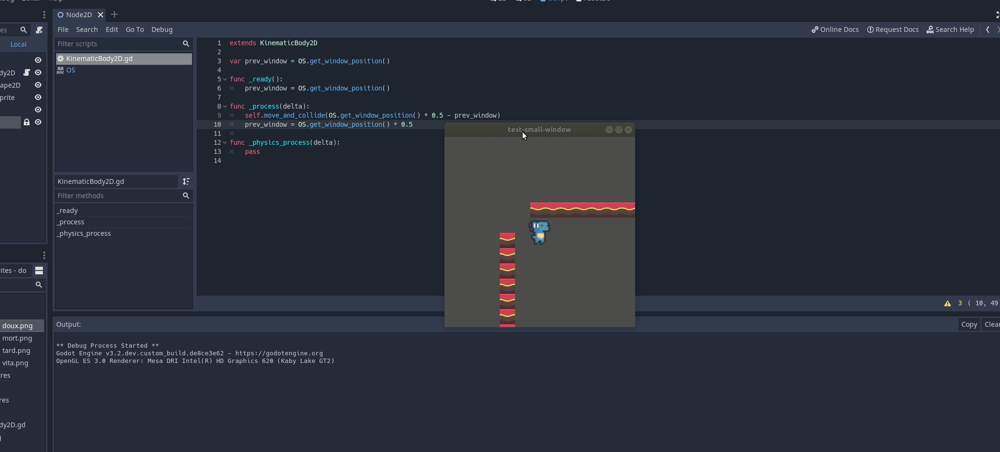

# Dumb simple mechanics

Just a place for me to dump simple mechanics implemented quickly in Godot

## Card Deck Exchange

This mechanic allows players to move cards and parent them to new locations.

## Simple network server

This mechanic hosts a server for multiple clients to connect to and set their
name.

## Location Navigated map

Forget what this one was suppose to be ¯\\_(ツ)_/¯

## Window Player Controller

This mechanic controls the player as they move the window around.

